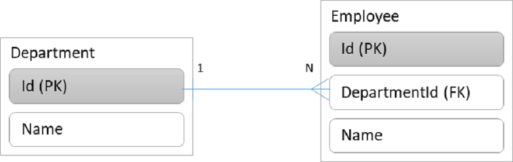
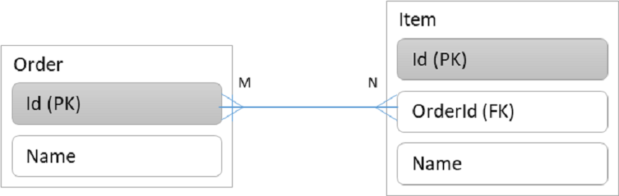

<h2 align="center">sads.js - Simple Application Data Service</h2>
<p align="center">
  <a href="http://nestjs.com/" target="blank"></a>
  <a href="https://aws.amazon.com/dynamodb" target="blank"></a>
</p>

<p align="center">
A quick PoC powerful RESTful <a href="http://nodejs.org" target="blank">Node.js</a> server for simple business requirements, based on <a href="http://nestjs.com/" target="blank">NestJS</a> and <a href="https://aws.amazon.com/dynamodb" target="blank">DynamoDB</a></p>


# Benefits from sads.js

With sads.js, you could provide powerful RESTful APIs in 20 minutes.

With sads.js, you don&#39;t have to start your projects with well-designed E-R diagrams and database designs. You don&#39;t have to log into the database manager and update database schemas and you don&#39;t have to run database migrations. You could easily change the database schemas because there are no physical schemas at all.

In summary, you could spend as less as possible on back-end and put more efforts on front-end design so that clients can see the scooter, the bicycle as early as possible.


How less do you have to work on back-end in the early stages (_before motorbike_) of the project?

- 20 minutes to start;
- 5-10 minutes for every new change;
- 2-3 days IN TOTAL

# Applicable Scenarios

In principle, sads.js is applicable to the scenarios of

- Small scale data storage (no more than thousands) &amp; medium level of complexity of entity relationships
- Large scale data storage with very simple entity relationships
- The data in the past are not allowed (or unnecessary) to be changed

Therefore, sads.js is pretty good at building scrum projects which started normally with only a couple of concepts without any detailed requirements, just like:

- Projects for PoC (_Proof of Concept_)
- Personal projects (_normally with very small data storage_)

# Quick Start

## Installation

```bash
$ npm install
```

## Setup local DynamoDB

please refer to [`dynamodb/README.md`](dynamodb/README.md)

## Running the app

```bash
# development
$ npm run start

# watch mode
$ npm run start:dev

# production mode
$ npm run start:prod
```

then launch your browser and navigate to the Swagger UI: http://localhost:3000/api 

## Test

```bash
# unit tests
$ npm run test

# e2e tests
$ npm run test:e2e

# test coverage
$ npm run test:cov
```


# Database Design Principles

## 1. Conceptually, use &#39;_Entity_&#39; in E-R Diagrams for &#39;_Tables_&#39; to avoid confusions
## 2. Every entity must contains fields **pk** and **sk**
## 3. The field **pk**
  * is used as id (_just like in RDBMS_),
  * should be a string BUT NOT AN INTEGER;
  * contains a guid/uuid string;
## 4. The field sk
  * is used as the entity name;
  * should be a string in the format of &quot;appName(_optional_) + entityName&quot;
## 5. 1-N Relationship

Consider the relationship below


With the N side entity as the base entity, here are the sample sads.js entities

**Department**
| **pk** | **sk** | **Name** |
| --- | --- | --- |
| DEPARTMENT#8260eb3a-b4d4-421a-9747-883c24ab57e0 | DEPARTMENT | HR |
| DEPARTMENT#db5873aa-2b8e-4b79-aec5-4afd21e4d7ec | DEPARTMENT | Sales |

**Employees**
| **pk** | **sk** | **Name** | **DepartmentKey** |
| --- | --- | --- | --- |
| EMPLOYEE#677dbc6b-909e-4537-8aa1-a7e56046d8aa | EMPLOYEE | John | DEPARTMENT#8260eb3a-b4d4-421a-9747-883c24ab57e0 |
| EMPLOYEE#4e81ad03-6213-47b4-a96d-3d76fc4e77ec | EMPLOYEE | Herry | DEPARTMENT#8260eb3a-b4d4-421a-9747-883c24ab57e0 |
| EMPLOYEE#85b8b502-bc93-42b8-b7c8-f0486ce7f41c | EMPLOYEE | Tom | DEPARTMENT#8260eb3a-b4d4-421a-9747-883c24ab57e0 |
| EMPLOYEE#380268b2-6f01-4d53-8948-f9c41fa2cc53 | EMPLOYEE | Jerry | DEPARTMENT#db5873aa-2b8e-4b79-aec5-4afd21e4d7ec |
| EMPLOYEE#ef9357aa-7952-4dcc-b500-ba6f2600bd42 | EMPLOYEE | Mike | DEPARTMENT#db5873aa-2b8e-4b79-aec5-4afd21e4d7ec |

## 6. N-M Relationship

Consider the relationship below



- Set `Order` as the base entity. Then you don't have to do anything with Order
- Set Item.sk as OrderId. Saying, Item.sk = Order.pk

Here are the sample records:

**Orders**

| **pk** | **sk** | **Name** |
| --- | --- | --- |
| ORDER#8260eb3a-b4d4-421a-9747-883c24ab57e0 | ORDER | Bunnings |
| ORDER#db5873aa-2b8e-4b79-aec5-4afd21e4d7ec | ORDER | Coles Pty Ltd |


**Items**
| **pk** | **sk** | **Name** |
|---|---|---|
| ITEM#677dbc6b-909e-4537-8aa1-a7e56046d8aa | ORDER#8260eb3a-b4d4-421a-9747-883c24ab57e0 | Spanner |
| ITEM#4e81ad03-6213-47b4-a96d-3d76fc4e77ec | ORDER#8260eb3a-b4d4-421a-9747-883c24ab57e0 | Hammer |
| ITEM#85b8b502-bc93-42b8-b7c8-f0486ce7f41c | ORDER#8260eb3a-b4d4-421a-9747-883c24ab57e0 | Nails |
| ITEM#380268b2-6f01-4d53-8948-f9c41fa2cc53 | ORDER#db5873aa-2b8e-4b79-aec5-4afd21e4d7ec | Milk |
| ITEM#ef9357aa-7952-4dcc-b500-ba6f2600bd42 | ORDER#db5873aa-2b8e-4b79-aec5-4afd21e4d7ec | White Bread |


# Stay in touch

- Author - [Derek Ji](https://derekji.github.io)

